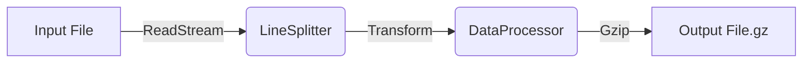

# Real-World NodeJS Streams Example

This project demonstrates a memory-efficient data processing pipeline using native NodeJS Streams. It simulates processing a large dataset (logs or user records) without loading the entire file into memory.

## 🚀 How to Run

1.  **Install Dependencies** (Standard Node environment, no external deps required):
    ```bash
    npm install
    ```

2.  **Generate Data**:
    Creates a `input-data.jsonl` file with 10,000 dummy records.
    ```bash
    npm run generate
    ```

3.  **Process Data**:
    Reads the input, filters, anonymizes, compresses, and writes to `output-data.jsonl.gz`.
    ```bash
    npm run process
    ```

4.  **Run All**:
    ```bash
    npm start
    ```

## 📂 Project Structure
*   `utils/LineSplitter.js`: Reusable Transform stream to split chunks into lines.
*   `constants.js`: Shared file paths.
*   `data-generator.js`: Creates dummy data.
*   `stream-processor.js`: Filter/Transform pipeline.
*   `http-stream-server.js`: Web server example.
*   `stream-types.md`: Educational doc.

## 📂 Code Explanation

### 1. `data-generator.js`
This script generates a synthetic dataset in **JSONL** (JSON Lines) format.
- It writes records one by one to a file stream.

### 1. `stream-processor.js` (Pipeline Example)
It constructs a processing pipeline:



*   **`ReadStream`**: Reads the file in generic binary chunks (64kb default).
*   **`LineSplitter` (Custom Transform)**:
    *   Since a randomly read chunk might cut a JSON line in half, this stream buffers partial lines and only emits full, valid strings to the next stage.
*   **`DataProcessor` (Custom Transform)**:
    *   **Parses** the JSON string.
    *   **Filters**: Ignores records marked as deleted.
    *   **Transforms**: Anonymizes PII (hashes the email address).
    *   **Re-serializes** the data to a string.
*   **`zlib.createGzip()`**: Built-in Node module to compress the data stream on the fly.
*   **`WriteStream`**: Saves the final compressed data to disk.

### 2. `express-server.js` (Express Server Example)
Demonstrates how to serve large files over HTTP using Express without holding them in memory.

*   Uses `readStream.pipe(res)` to send data to the client efficiently.
*   Handles backpressure automatically: if the user's internet is slow, the server slows down reading the file.

## 📚 Learn More
I have included a detailed guide on the 4 types of streams:
👉 **[Read Stream Types Explanation](stream-types.md)**

## Why Streams?
If `input-data.jsonl` were 10GB, a standard `fs.readFile` would crash your application with an "Out of Memory" error. This stream implementation only keeps small chunks in memory at a time, allowing it to process petabytes of data with constant memory usage.
